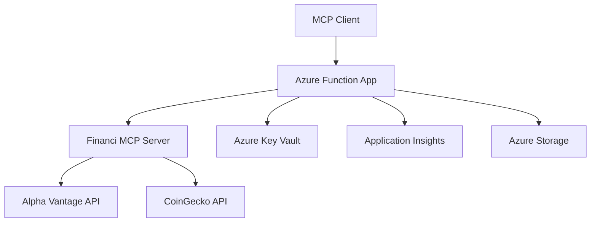

# Financi - Financial Analysis MCP Server

[](https://dev.azure.com/your-org/financi/_build/latest?definitionId=1&branchName=main)
[](LICENSE)
[](https://python.org)
[](https://docs.microsoft.com/en-us/azure/azure-functions/)

Financi is a Python-based Model Context Protocol (MCP) server deployed as an Azure Function App, providing comprehensive financial analysis tools for stocks and cryptocurrencies. This server enables AI assistants and applications to access real-time financial data, perform technical analysis, and calculate financial metrics through a standardized MCP interface.

## 🚀 Features

### Stock Analysis Tools
- **Real-time Stock Prices**: Get current stock quotes with price, volume, and change data
- **Historical Data**: Access historical price data for technical analysis
- **Technical Indicators**: Calculate RSI, MACD, SMA, EMA, and other technical indicators
- **Financial Ratios**: Retrieve key financial metrics for fundamental analysis

### Cryptocurrency Analysis
- **Crypto Prices**: Real-time cryptocurrency prices and market data
- **Market Metrics**: 24h volume, market cap, and price changes
- **Multi-currency Support**: Price data in various fiat currencies

### Portfolio Management
- **Portfolio Analysis**: Analyze mixed portfolios of stocks and cryptocurrencies
- **Asset Allocation**: Calculate portfolio diversification and allocation percentages
- **Performance Tracking**: Monitor portfolio value and individual asset performance

## 🏗️ Architecture



## 📋 Prerequisites

- **Azure Subscription**: Valid Azure subscription with appropriate permissions
- **Azure CLI**: Latest version installed and configured
- **Python 3.11+**: For local development and testing
- **Azure DevOps**: For CI/CD pipeline (optional)
- **API Keys**: 
  - Alpha Vantage API key for stock data
  - Additional financial APIs (optional)

## 🛠️ Installation & Deployment

### Option 1: Automated Deployment via Azure DevOps

1. **Fork this repository** to your Azure DevOps organization

2. **Configure Service Connection**:
   ```bash
   # In Azure DevOps, create a service connection to your Azure subscription
   # Name it 'financi-service-connection' to match the pipeline configuration
   ```

3. **Set Pipeline Variables**:
   - `AZURE_SUBSCRIPTION_ID`: Your Azure subscription ID
   - `ALPHA_VANTAGE_API_KEY`: Your Alpha Vantage API key (mark as secret)

4. **Run the Pipeline**:
   - The pipeline will automatically deploy infrastructure and function code
   - Monitor the deployment in Azure DevOps

### Option 2: Manual Deployment

#### Step 1: Deploy Infrastructure

```bash
# Clone the repository
git clone https://github.com/your-username/financi.git
cd financi

# Create resource group
az group create --name rg-financi --location "East US 2"

# Deploy Bicep template
az deployment group create \
  --resource-group rg-financi \
  --template-file infrastructure/main.bicep \
  --parameters infrastructure/parameters.json
```

#### Step 2: Deploy Function Code

```bash
# Install dependencies
pip install -r requirements.txt

# Create deployment package
cd src
zip -r ../function-app.zip .

# Deploy to Azure Functions
az functionapp deployment source config-zip \
  --resource-group rg-financi \
  --name your-function-app-name \
  --src ../function-app.zip
```

#### Step 3: Configure API Keys

```bash
# Store API key in Key Vault (recommended)
az keyvault secret set \
  --vault-name your-keyvault-name \
  --name "ALPHA-VANTAGE-API-KEY" \
  --value "your-api-key"

# Or set as Function App setting (less secure)
az functionapp config appsettings set \
  --name your-function-app-name \
  --resource-group rg-financi \
  --settings "ALPHA_VANTAGE_API_KEY=your-api-key"
```

## 📖 Usage

### MCP Client Configuration

Configure your MCP client to connect to the deployed Function App:

```json
{
  "mcpServers": {
    "financi": {
      "command": "npx",
      "args": [
        "@modelcontextprotocol/server-fetch",
        "https://your-function-app.azurewebsites.net/api/mcp"
      ]
    }
  }
}
```

### Available Tools

#### 1. Get Stock Price
```javascript
// Get current stock price
{
  "name": "get_stock_price",
  "arguments": {
    "symbol": "AAPL"
  }
}
```

**Response:**
```json
{
  "symbol": "AAPL",
  "price": 150.00,
  "change": 2.50,
  "change_percent": "+1.69%",
  "volume": 1000000,
  "latest_trading_day": "2024-01-01",
  "previous_close": 147.50
}
```

#### 2. Get Stock History
```javascript
// Get historical data
{
  "name": "get_stock_history",
  "arguments": {
    "symbol": "MSFT",
    "period": "1mo"
  }
}
```

#### 3. Calculate Technical Indicators
```javascript
// Calculate RSI and moving averages
{
  "name": "calculate_technical_indicators",
  "arguments": {
    "symbol": "TSLA",
    "indicators": ["rsi", "sma_20", "sma_50"],
    "period": "3mo"
  }
}
```

#### 4. Get Cryptocurrency Price
```javascript
// Get crypto price
{
  "name": "get_crypto_price",
  "arguments": {
    "symbol": "bitcoin",
    "vs_currency": "usd"
  }
}
```

#### 5. Portfolio Analysis
```javascript
// Analyze portfolio
{
  "name": "portfolio_analysis",
  "arguments": {
    "holdings": [
      {"symbol": "AAPL", "quantity": 10, "type": "stock"},
      {"symbol": "bitcoin", "quantity": 0.5, "type": "crypto"}
    ]
  }
}
```

### Health Check

Test the deployment with the health endpoint:
```bash
curl https://your-function-app.azurewebsites.net/api/health
```

## 🧪 Testing

### Local Development

```bash
# Install dependencies
pip install -r requirements.txt

# Run tests
pytest tests/ -v --cov=src

# Run with coverage report
pytest tests/ --cov=src --cov-report=html
```

### Integration Testing

```bash
# Test health endpoint
curl https://your-function-app.azurewebsites.net/api/health

# Test MCP endpoint with sample request
curl -X POST https://your-function-app.azurewebsites.net/api/mcp \
  -H "Content-Type: application/json" \
  -d '{
    "method": "tools/list"
  }'
```

## 🔧 Configuration

### Environment Variables

| Variable | Description | Required | Default |
|----------|-------------|----------|---------|
| `ALPHA_VANTAGE_API_KEY` | Alpha Vantage API key for stock data | Yes | - |
| `MCP_SERVER_NAME` | Server identification name | No | `financi` |
| `MCP_SERVER_VERSION` | Server version | No | `1.0.0` |
| `LOGGING_LEVEL` | Python logging level | No | `INFO` |

### API Rate Limits

- **Alpha Vantage Free**: 5 requests per minute, 500 per day
- **CoinGecko**: 10-50 requests per minute (depending on plan)

Consider upgrading to premium plans for production usage.

## 🔐 Security

### API Key Management
- Store sensitive API keys in Azure Key Vault
- Use Azure Function App's managed identity for Key Vault access
- Rotate API keys regularly

### Network Security
- Enable HTTPS-only for Function App
- Configure CORS settings appropriately
- Consider using Azure API Management for additional security layers

### Monitoring
- Application Insights enabled by default
- Monitor API usage and costs
- Set up alerts for errors and rate limit exceeded

## 📊 Monitoring & Observability

### Azure Application Insights

The Function App is configured with Application Insights for comprehensive monitoring:

- **Performance Metrics**: Response times, throughput, and availability
- **Error Tracking**: Automatic exception capture and logging
- **Custom Metrics**: API usage patterns and financial data requests
- **Live Metrics**: Real-time performance monitoring

### Log Analytics

Query logs using Kusto Query Language (KQL):

```kusto
// Failed requests in last 24 hours
requests
| where timestamp > ago(24h)
| where success == false
| summarize count() by resultCode, name

// Top requested financial symbols
traces
| where message contains "get_stock_price"
| extend symbol = extract(@"symbol: ([A-Z]+)", 1, message)
| where isnotempty(symbol)
| summarize count() by symbol
| top 10 by count_
```

### Alerting

Set up alerts for:
- Function App errors > 5% over 5 minutes
- Response time > 30 seconds
- API rate limit exceeded
- High cost consumption

## 🚀 Performance Optimization

### Caching Strategy
- Implement Redis cache for frequently requested stock prices
- Cache technical indicator calculations
- Use appropriate TTL based on data freshness requirements

### Scaling Configuration
```json
{
  "functionTimeout": "00:05:00",
  "extensions": {
    "http": {
      "maxOutstandingRequests": 200,
      "maxConcurrentRequests": 100,
      "dynamicThrottlesEnabled": true
    }
  }
}
```

### Cost Optimization
- Use Consumption plan for variable workloads
- Monitor API call costs and optimize requests
- Implement intelligent caching to reduce external API calls

## 🛣️ Roadmap

### Version 1.1
- [ ] Redis caching implementation
- [ ] Additional financial APIs (IEX Cloud, Financial Modeling Prep)
- [ ] Options and derivatives support
- [ ] News sentiment analysis

### Version 1.2
- [ ] Real-time streaming data via WebSockets
- [ ] Advanced portfolio optimization algorithms
- [ ] ESG (Environmental, Social, Governance) scoring
- [ ] Backtesting capabilities

### Version 2.0
- [ ] Machine learning predictions
- [ ] Custom indicator development
- [ ] Multi-region deployment
- [ ] GraphQL API support

## 🤝 Contributing

1. **Fork the Repository**
2. **Create Feature Branch**: `git checkout -b feature/amazing-feature`
3. **Commit Changes**: `git commit -m 'Add amazing feature'`
4. **Push to Branch**: `git push origin feature/amazing-feature`
5. **Open Pull Request**

### Development Guidelines
- Follow PEP 8 style guidelines
- Add tests for new features
- Update documentation
- Ensure all tests pass

## 📄 License

This project is licensed under the MIT License - see the [LICENSE](LICENSE) file for details.

## 🆘 Support

### Documentation
- [Azure Functions Python Developer Guide](https://docs.microsoft.com/en-us/azure/azure-functions/functions-reference-python)
- [Model Context Protocol Specification](https://modelcontextprotocol.io/)
- [Alpha Vantage API Documentation](https://www.alphavantage.co/documentation/)

### Getting Help
- Create an [issue](https://github.com/your-username/financi/issues) for bugs or feature requests
- Check [existing issues](https://github.com/your-username/financi/issues) before creating new ones
- Join discussions in the [Discussions](https://github.com/your-username/financi/discussions) section

### Troubleshooting

#### Common Issues

**1. API Key Not Working**
```bash
# Verify API key is set correctly
az functionapp config appsettings list --name your-function-app --resource-group rg-financi
```

**2. Function App Cold Start**
- Use Premium plan for production to avoid cold starts
- Implement warming strategies for Consumption plan

**3. Rate Limit Exceeded**
- Monitor API usage in Application Insights
- Implement caching to reduce API calls
- Consider premium API plans

## 📞 Contact

**Project Maintainer**: Your Name  
**Email**: your.email@example.com  
**LinkedIn**: [your-linkedin-profile](https://linkedin.com/in/your-profile)

---

⭐ If you found this project helpful, please give it a star on GitHub!

Made with ❤️ and ☕ by the Financi team